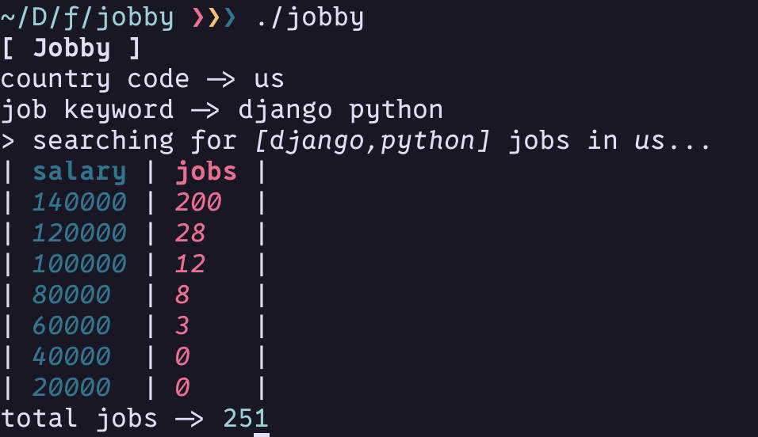

# Jobby cli for the jobless

- I'm using adzuna because they have a free api, you just need an account for keys.
- requires api and app id's from **adzuna** api dashboard
    + place them in `$HOME/.config/jobby/jobby.json`

```json
{
    "app_id" : "your app id",
    "api_id" : "your api id"
}
```

- it takes the 2 letter country code and a " " separated list of job keywords

# demo


